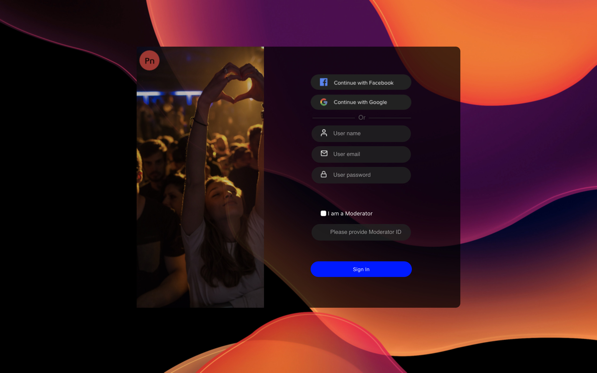

# ReactJS Live Stream Chat Starter Kit


## Background
React JS is now the most used framework used by Internet companies to develop the web apps they generate most revenue from.

TypeScript is a type safe language built on top of java script and it is now the new standard in the React JS world.

React offers an easy way to group UI elements into Components so a Chat application can turn from a 100 UI objects, or more, to a 5 UI objects application, and experience less than 250ms delivery time from anywhere to anywhere in the world.

Once a developer uses React Components it becomes a matter of hours before a full fledged mission critical chat solution is offered to anyone in the world who wants to connect.

By leveraging open source tools and components it is possible to create a world class, mission critical, and maintainable chat service, surfacing over the web and mobile devices, while relying on an infrastructure provider to deliver messages anywhere on the Internet.

A reliable Chat back-end provider offers message deliverability, presence indicators and other related data in a predictable fashion so the React based front end can not only be suited to users taste and current habits but, no puns intended, also react to network messages without which there is no UI that would serve any user.

[Live Demo of Live Event Chat Demo](https://nfodorpubnubcdn.imfast.io/)


## What to do with this repository?

This is an example of how to integrate open source components, including React chat components, with one notable message and presence service provider: PubNub.

Even though PubNub is offering a solid Java Script SDK to drive the React components along with the business specific logic, you will not need it to know it to run this demo. It is preferable to be familiar with Typescript and React if you wish to modify our React Components for your own use.

This repository is based, not only on a reliable chat backend provider, already processing billions of messages, but also it is based only on open source tools with significant following on github so there is a better chance to see them maintained in the future.

You should only have to bring the design if you want to change it and the repository does provide some starter ones.

The repository includes the javascript libraries that allow for easier access to the chat service provider without the need to use a lower level interface such as REST.

It also includes standard React components that can be dressed up through so named "Styled Components".

The Sketch file in this repository contains reusable UI symbols. And even you do not need to be familiar with Sketch Symbols, if you are, you can leverage the latest Sketch technology, including "Symbol Overrides" to completely customize the UI without loosing any time.

Sketch Overrides save time because this feature allows to use only one Sketch visual component per visual state this component will display once live on the screen.
Using Overrides one can simply override each component property, including graphics and see how the new graphics integrate in the live template inside Sketch. If you have professional designers available to you they will certainly appreciate the time it saves them to start from Sketch files including relevant Overrides properties set.


## What does this repository contain?

* A sample Sketch design file that maps to the css delivered in the source code so your Chat app can look designer generated.

* React files, and React js libraries, in typescript, allowing to run a web server application for hosting a Chat app and connect to it locally and through your LAN. It can run on your computer or served hosted anywhere on the Internet for public access.

* A list of third party libraries used in the app is available in the package.json file, you don't need to open it to run the app. The command « yarn install » ran from the terminal will update your code with fresh cloned files for the versions of these libraries, it looks on that package.json file to make sure all libraries are available to your app.

* The PubNub Live Event Chat Components library to display the chat UI and content.

## PubNub Account

To run this application you must obtain publish and subscribe keys from your PubNub Account. If you don't already have an account, you can create one for free.

### Sign in to your PubNub Dashboard.

#### Click Create New App.

* Give your app a name, and select Chat App as the app type.

* Click Create.

* Click your new app to open its settings, then click its keyset.

* Enable the Objects feature. Presence and PubNub Functions should have been enabled when the keyset was created.

* Select a region to store your user data (e.g. US East).

* Locate the Publish and Subscribe keys. You'll need these keys to include in this project.

You can run this web app on your computer or run it out from your web browser on Gitpod:

## Edit the code and run the app in your browser

[](https://gitpod.io/#snapshot/632b4edd-7187-4a7e-af4d-064b6b82c4a7)

## Run the app on your local machine

### Setting up a Node.js development environment

First, if you did not already, prepare your machine for node.js based development. Most of the tooling used for this demo relies on it.

The best way to install node.js is to first install nvm from the command line by following the instructions here (<https://github.com/nvm-sh/nvm#installation>).

Then you can run:

```bash
nvm install stable
```

* Run the git command from a terminal and install git if it returns an error.

(<https://git-scm.com/book/en/v2/Getting-Started-Installing-Git>)

* Clone this repository in your work directory from the terminal after cd into it:

```script
# git clone https://github.com/PubNubDevelopers/chat-component-app-live-event
```

* Install yarn: `curl -o- -L https://yarnpkg.com/install.sh | bash`

### Launching the app

* Launch the terminal, cd in the project directory and type each command below, then press enter. The last command should run the server, launch your web browser and connect to the localhost and the right port automatically. (`yarn firehose` will let you set your keys and send messages to the same channel your app is preset to connect to. You must run it at least once. After it is has run it will create a pubnub-keys.json file in the src/config directory, it can be manually edited after it has been created automatically and contains the following information: `{ "publishKey": "YOUR PUBLISH KEY", "subscribeKey": "YOUR SUBSCRIBE KEY" }`.) :

    `yarn install`

    `yarn firehose`

* In another terminal window cd in the same project directory and run:
    `yarn start`

This will let you see messages sent through the "yarn firehose" command on one terminal window while you can see your app console loggin in the other terminal window.

To point your browser to your running app you must use this url (<http://localhost:8080>)

To learn more about the file structure and which file you have to modify so you can make your own Live Stream Event Chat App with your own design please read the Customization section included here.

If you want to bypass our beautiful login screen and access the Live Event selection process directly you can edit the Router.tsx file around line 14 and change false to true in:

```tsx
<Wrapper>
      <AppStateProvider>
      {true  ? <ChatDemo /> : <Login  />}
      </AppStateProvider>
</Wrapper>
```

(You do not need to restart the App by running "yarn start" since webpack reloads the chat server files automatically when detecting a change in one of them, so if you have a browser openeed to your app address you will see the updates on the page immediately):

## Visuals

### Live Event

The Live Event screen itself is divided into multiple panels, each panel is a React Component you can reuse for your own app. The components used in this app contain standard PubNub React Chat components.

To use this code into your own Live Event React app using TypeScript all you have to do is to copy the components folders to your project from the src directory in this repository along with the AppStateContext.tsx file.

To customize this project non visual settings you can change the Live Event parameters in the AppStateContext.tsx file:

```tsx
//This is where you define the Live Event Properties.
export const appData: AppState = {
  simulateLogin: true,
  eventName: "PubNub Live Event", //Event name as displayed by components.
  maxMessagesInList: 200, //Max number of messages displayed at most in the message list. the more messages the more memory will be consumed by the browser.
  eventId: "PNEVT001", //Event ID as displayed by components.
  messageListFilter: `language_tone != 'offensive'`, //See README before changing this value.
  //messageListFilter: `language_tone != 'offensive'`,
  eventHostAvatar: "https://robohash.org/ipsaquodeserunt.jpg?size=50x50&set=set1", //The URL for the host avatar graphic file
  eventAvatar:"https://nfodorpubnubcdn.imfast.io/images/companyLogo@3x.png",
```

#### ChatDemo

This is the main screen where participants can view the Event and chat with other event participants.
It is located in the src/components/ChatDemo/ChatDemo.tsx file:

````tsx
  <ChatDemoWrapper >

     <EventDetailsTop/>

     <LiveFeedPanelYouTube videoID="jZtxlp664yU"  opts={opts} onReady="(event) => {
       event.target.pauseVideo();
     }"/>

   <EventDetailsBottom />

     <MessageListPanelWrapper>

          <MessageListPanel/>

     </MessageListPanelWrapper>

  </ChatDemoWrapper>
````

#### LiveFeedPanelYouTube

This is the part of the screen where the event itself is to be displayed.

This is a simple example using a YouTube stream that is simple passed inside the LiveFeedPanelWrapper tags.

The parameters to control the display of the YouTube stream source is passed using props.

These props are passed from a higher level component in the component tree where you have previously defined them, so there should be no need to edit this file unless you want to add a streaming provider of your own or change the settings for the default Stream provider.

```tsx
 <LiveFeedPanelWrapper>
      <YouTube videoId={props.videoID} opts={props.opts} onReady={props.onReady} />
 <LiveFeedPanelWrapper>
```

#### MessageListPanel

```tsx
      <AppStateProvider>
        {<MessageList/>}
      </AppStateProvider>
```

#### Message

This component displays each message in the message list.

```tsx
<Message message={onemessage} key={onemessage.key} />
```

It is used often within a loop to display a list of messages by other components such as by the MessageList component that loops within the current list of messages in a channel to display, one by one, in a loop or in map as it is shown below:

```tsx
  const Messages = Array.from(state.messages).map((onemessage: UserMessage) => {
    return (
      <>
        <div ref={messagesEndRef} />
        <Message message={onemessage} key={onemessage.key} />
      </>
    );
  }
  );
```

#### ComposeMessageBox

This is where the chat user composes messages to be sent to the event chat channel.

````tsx
      <ComposeMessageBoxWrapper>
        <UserImgWrapper src="https://nfodorpubnubcdn.imfast.io/images/hostImage@3x.png" />
        <TextInputWrapper></TextInputWrapper>
        <EmojiInputWrapper src="https://nfodorpubnubcdn.imfast.io/images/emojiInput@3x.png" />
      </ComposeMessageBoxWrapper>
````

<!-- ### Event selection:

TO BE COMPLETED

### Moderator: 
TO BE COMPLETED

-->

## Storybook

Storybook provides with a list of components and how they would appear "Live" in your app, among other great features it can offer. To run storybook: Run the terminal and cd from the same directory your project is in, then type the following command: 

`yarn storybook`

The Storybook will launch and provide you the URL to point your browser to, the page displays the Components Gallery, for each component you can copy and paste its code and view it isolated in its context.

## Using the Sketch file

This Live Event Chat app provides a very simple way to show how it is possible to add Chat fonctionalities to an existing React app or simply use as a template for your own Live Chat Event.
Some simple components are provided that you can simply copy and paste in your code. Or you can run this application on a server, as is, to experiment with PubNub scalability and responsiveness.

The Live Event Chat app is based on a professional UI design built with [Sketch](https://www.sketch.com/). You can find the Sketch file used for this design in the root of this repository in a file named: "Live Event Chat.sketch".

The Sketch file contains Sketch "Symbols". Each Symbol matches a React Component and a React "Styled Component".

By generating Symbols from Sketch graphics it is possible to isolate the parts of the screen that matches the components in code and group these parts into clearly defined and reusable Symbols. Sketch Symbols can be reused in a new Sketch design document by simply dragging them from the Sketch Symbols List to the artboard.

It is also common practice to use such named: "Design Systems" when working with large projects involving both a development and a design team so their working on the same components can stay synchronized and usable by the rest of the teams and future team members so they have a quick view as well as easy drilling into each component, both from code and design. One popular design system is Zeplin and its use for this project is described at the end of this document. Zeplin is not needed to run this project, nor Sketch, but they will allow you to reuse this project effectively if you are working in an environment where the engineering and design team must work effectively together.

This project contains a Live Event Chat simulator of chat messages.


### PubNub Symbols

The simplest way to modify the provided Sketch file design provided and to quickly reflect the changes in the app is by modifying the matching Symbol in the Sketch file for the React Component you wish to change the display for.

The best way to understand the relationship between components and the Sketch file Symbols is by cutting the code as shown below. A React Component named PromotionAd is cut before being pasted again, and before it is pasted again you see the picture disappear on the page rendered in the browser. This illustrate the correspondance between the code and the visibility of a component rendered live on the screen:


This was about deleting the PromotionAd component all together from the page. But say you want to change the picture but keep that PromotionAd React Component on the page, then, first open the Sketch file and find the promotionAd Symbol then we will use the very powerful "Symbol Override" feature to pick another picture and easilly export it from Sketch to our img directory that contains all our images assets. You can see how it is done below:

Open the Sketch file and select "Layers" from the Side Bar on the left of the screen. Type: "promotionAd" in the "Search Layer" box then click on Symbol in the Inspector pane on the right of the screen:



The tag to customize the Login screen with your design can be found in /src/components/PromotionAd/PromotionAd.styles.tsx
To change the design all you need to do is edit the design file included inside the directory: The name of the file is Login.style.tsx.

You can try it out by adding your own image file instead of the one on the login screen for example:

1. Drop a file into the /src/img directory and remember its name because you will need it in the next step.

2. Then simply change the name of the image file in the PromotionAd.style.tsx where it shows: `background: url("images/promotionAd.png") no-repeat;`

### PubNub Live Chat Components

#### AppStateProvider Component

```tsx
      <AppStateProvider>
        {<MessageList/>}
      </AppStateProvider>
```

This component is not a visual component, meaning it that it does not render on the screen, instead it must be included around any of the other PubNub Chat components that display any of Chat related data, this includes the ComposeMessageBox Component and the MessageList component.

#### MessageList Component

```tsx
      <AppStateProvider>
        {<MessageList/>}
      </AppStateProvider>
```

<!-- #### Login Components

##### In: src/components/Login.tsx

```tsx
...

interface LoginInitProps {
 simulate: true
}


const Login: React.SFC<LoginInitProps> = (props: LoginInitProps) => {

return(

  <PubNubDesigner>

  <CenterLoginBox>

        <PromotionAd>

        </PromotionAd>

      <LoginForm>

            <ButtonLoginFacebook></ButtonLoginFacebook>
          
            <ButtonLoginGoogle></ButtonLoginGoogle>
         
        <LoginFormDividerOr></LoginFormDividerOr>
          
            <LoginFormInputUserName></LoginFormInputUserName>
            
            <LoginFormInputEmail></LoginFormInputEmail>
            
            <LoginFormInputPassword></LoginFormInputPassword>
            
            <StyledCheckBox text="I am a Moderator"></StyledCheckBox>
            <LoginFormModeratorID></LoginFormModeratorID>
            
            <ButtonLogin>Sign In</ButtonLogin>

      </LoginForm>

    </CenterLoginBox>

  </PubNubDesigner>
);
...
``` -->

### Simulating chat users sending messages.

This project contains a script file in the tools directory named firehose.js. You can simply run it from the command line by running:

```tsx
yarn firehose
```

If you want to change the channel the messages are sent you can edit the package.json file and search for the line containing "node firehose.js liveeventdemo.row1" and change "liveeventdemo.row1" to whatever channel you are using when running the project. Please note that "liveeventdemo.row1" is an arbitrary name but must be the same for people to see the same messages showing up from the firehose script.
You can edit this script to change the timing or the source of the messages sent through the channel.
You can also run the firehose.js file individually by running the following from the terminal after you cd inside the tools directory:

```script
node firehose.js channelname
```

### About React

A JavaScript library for building user interfaces. <https://reactjs.org/>

### About TypeScript

TypeScript is a typed superset of JavaScript that compiles to plain JavaScript.

Any browser. Any host. Any OS. Open source.

<https://www.typescriptlang.org>

### About PubNub React library for Java Script

This is the library used internally by the components to connect this React web application with the PubNub backend. You don't need to learn it to use the existing components, but it is required if you want to build your own components.

### About Styled Components

Styled Components is simply the name of a library now commonly used along with React Apps because it allows to wrap visual React Components around Wrapper components that control the look of the Components wrapped inside.

You don't need to learn it to use the existing components, but it is required if you want to build your own components or if you want to customize the components provided in this repository.

(<https://styled-components.com/docs/basics#styling-any-component>)

### About Sketch

Create, prototype, collaborate, and bring your ideas to life with the design platform used by over one million people — from freelancers, to the world’s largest teams.

(https://sketch.com)

### About Zeplin

The better way to share, organize and collaborate on designs—built with developers in mind.

(<https://zeplin.io/>)

If you have Sketch installed you can install the Zeplin extension to Sketch and you will be able to connect this project with Sketch through your Zeplin account. You can learn about how Zeplin and Sketch work together to compose a so called "Design System" as it is commonly used for large projects. (<https://webdesign.tutsplus.com/articles/sketch-and-zeplin-helping-designers-and-developers-collaborate--cms-26421>)


Zeplin will let you keep a bird view on how your design in Sketch maps with your code if you wish to create advanced UI from your Sketch files and wish to keep track at all time of the matching components and their visual counterpart both in code and visual by visually linking all involved digital resources. Digital resources can include your github repository, your local IDE files, and you can add more because Zeplin, itself a plugin for Sketch, does support plugins, called extensions, (<https://extensions.zeplin.io/>) of its own.

This project contains a components.json file in the  .zeplin directory. You can edit this file to map Zeplin objects to your code components. This is how we map our PubNub components to the Zeplin project accessible on the web:

```json
            "path": "src/components/MessageListPanel/MessageListPanel.tsx",
            "zeplinNames": [
                "hostMessage",
                "blockedUser",
                "messageList",
                "menuMessageAdminActions",
                "deletedMessage",
                "messageListHeader",
                "MessageListSettings",
                "messageItem"
            ]
```
It is based on this map that it becomes possible to automatically sync all digital asserts and display their correspondance from the Zeplin app on the web or the desktop:


(If you use Microsoft Visual Code you can install the Zeplin extension and automatically configure the maping between your code and Zeplin components (<https://blog.zeplin.io/introducing-zeplin-for-visual-studio-code-edbc922a5784>))


